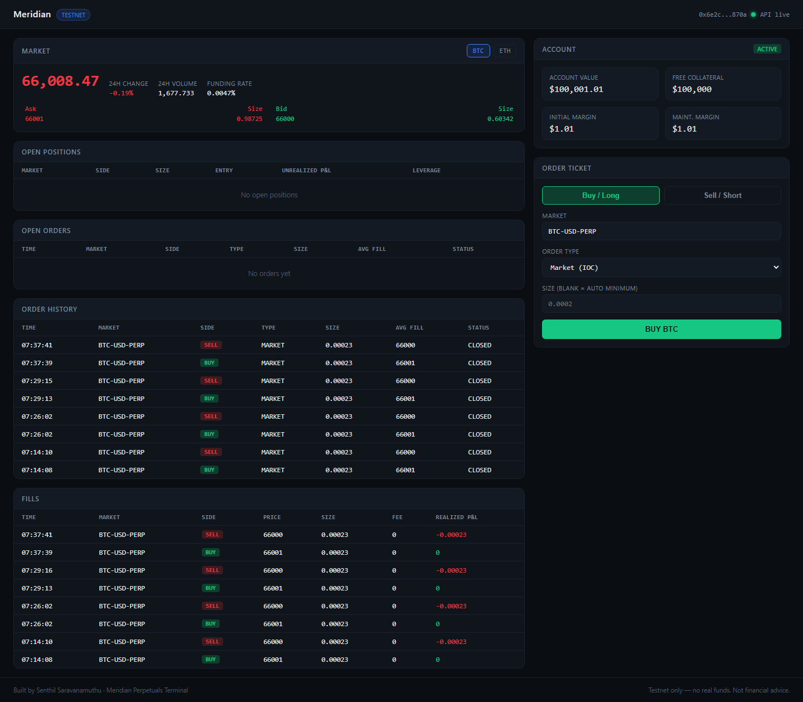
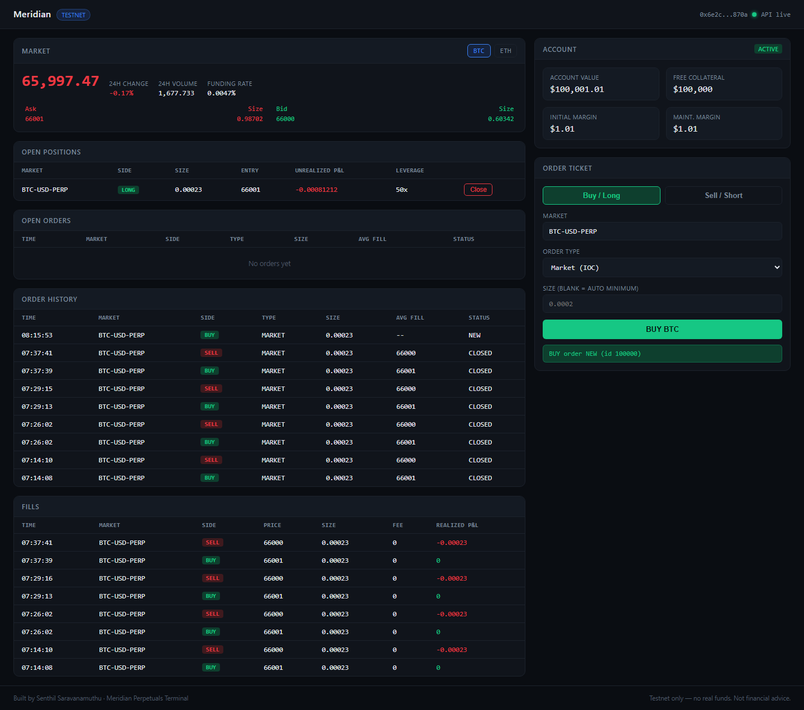
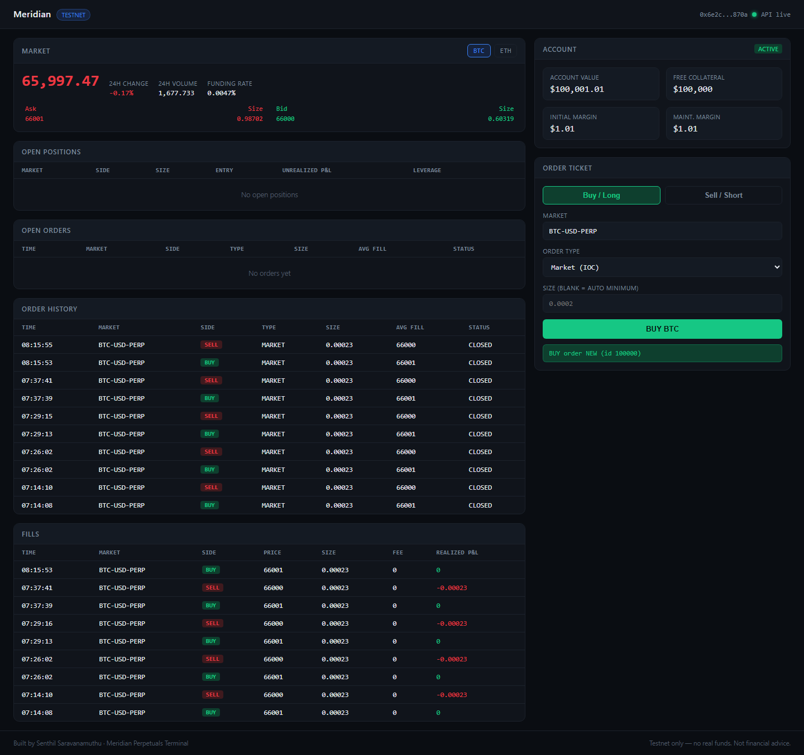

# User Guide — Placing a Trade End-to-End (Worked Example)

**Author:** Senthil Saravanamuthu

This walks through exactly what happens when you place a trade in Meridian, with real
numbers from an actual run — not hypothetical ones. If you're coming from stocks: a perp
doesn't have "shares." You're trading a contract sized in the underlying asset (BTC, ETH),
and your P&L is `(exit price − entry price) × size`. Below, "size" is the number you'd
otherwise think of as "how many shares."

---

## Step 0 — What you're looking at

Open `http://localhost:5173` (with `backend` running on :8000). You'll see:

| Panel | What it shows |
|---|---|
| **Market** (top left) | Live price, 24h change, bid/ask, funding rate |
| **Account** (top right) | Your buying power: account value, free collateral, margin used |
| **Order Ticket** (right) | Where you place a trade |
| **Open Positions** | What you currently hold |
| **Open Orders / Order History / Fills** | What happened, in order |



Before placing anything, this is what "ready to trade" looks like:

- Account Value: **$100,001.01**
- Free Collateral: **$100,000**
- Open Positions: **none**
- BTC-USD-PERP: bid **$66,000** / ask **$66,001**

---

## Step 1 — Decide how much to buy ("how many shares")

You don't have to compute this by hand — leave the **Size** field blank and the backend
computes the minimum valid size for you. But here's exactly how it's computed, so you know
what number you're about to trade:

```
min_notional (from the exchange's contract spec)   = $10   (BTC-USD-PERP)
mark_price (current)                                = $65,988.87
safety_multiplier (our default, headroom above the minimum) = 1.5

raw_size   = (min_notional × safety_multiplier) / mark_price
           = ($10 × 1.5) / $65,988.87
           = 0.0002273 BTC

order_size_increment (smallest allowed step) = 0.00001 BTC
size, rounded UP to the nearest increment    = 0.00023 BTC
```

**So: 0.00023 BTC** is "how many you're buying" — at a mark price of ~$66,000, that's
about **$15.18 of notional exposure**. This is deliberately tiny (a smoke-test size); type
a specific number into the Size field (e.g. `0.001`) if you want a bigger position.

---

## Step 2 — Place the BUY

Click **Buy / Long**, leave Order Type as **Market (IOC)**, leave Size blank, click
**BUY BTC**.

**What happens immediately:**
1. Backend builds a signed `MARKET` / `IOC` order for 0.00023 BTC and POSTs it
2. The exchange matches it instantly against the resting ask
3. Response comes back and shows in the ticket as a toast

**Real example response:**
```json
{
  "id": "1784848448630201703945910000",
  "status": "NEW",
  "side": "BUY",
  "size": "0.00023",
  "instruction": "IOC"
}
```
`status: NEW` here is transient — IOC orders resolve in milliseconds. The next check is
what confirms it actually filled.

---

## Step 3 — Check the order status

The UI's **Open Orders** table polls this automatically, but here's what "checking status"
actually means underneath: a `GET /api/orders/{id}` call. A filled IOC order looks like:

```json
{
  "status": "CLOSED",
  "avg_fill_price": "66001",
  "remaining_size": "0"
}
```

`status: CLOSED` + `remaining_size: 0` = fully filled, nothing left resting. (For the
exchange, "CLOSED" is their status for a terminated order — filled or cancelled; `avg_fill_price`
being non-empty is what tells you it filled rather than got cancelled.)

---

## Step 4 — Confirm the fill and the position

**Fill record** (`GET /api/fills`):
```json
{
  "side": "BUY",
  "price": "66001",
  "size": "0.00023",
  "fee": "0",
  "realized_pnl": "0"
}
```

**Position now open** (`GET /api/positions`), and this is the live view the dashboard
shows in the "Open Positions" table:

```json
{
  "market": "BTC-USD-PERP",
  "side": "LONG",
  "size": "0.00023",
  "average_entry_price": "66001",
  "unrealized_pnl": "0.0008316",
  "leverage": "50"
}
```



You're now **long 0.00023 BTC at $66,001**, 50x leverage (the exchange's default for this
market), unrealized P&L moving with the mark price in real time.

---

## Step 5 — Monitor P&L

`unrealized_pnl` recalculates every tick as `(mark_price − entry_price) × size`. Watch the
**Account** panel too — `account_value` moves with it, since unrealized P&L is part of your
total account value even before you close.

---

## Step 6 — Close the position (the "sell" side)

You don't manually re-enter a SELL order with a matching size — click **Close** on the
position row instead. Under the hood this:

1. Looks up your current position size (0.00023 BTC, LONG)
2. Builds the **opposite** side order (SELL) for the **same size**, flagged `reduce_only`
   so it can only close the position, never flip it into a short
3. Submits it as MARKET/IOC, same as the buy

**Real example response:**
```json
{
  "side": "SELL",
  "size": "0.00023",
  "flags": ["REDUCE_ONLY"],
  "status": "NEW"
}
```

## Step 7 — Confirm it's flat

```json
{
  "market": "BTC-USD-PERP",
  "status": "CLOSED",
  "size": "0",
  "unrealized_pnl": "0"
}
```



---

## Step 8 — Trade history (the audit trail)

Both legs now show up in **Order History** and **Fills**:

| Time | Side | Size | Avg Fill | Status |
|---|---|---|---|---|
| 07:29:13 | BUY | 0.00023 | 66001 | CLOSED |
| 07:29:15 | SELL | 0.00023 | 66000 | CLOSED |

**Realized P&L on this round trip:** bought at 66001, sold at 66000 →
`(66000 − 66001) × 0.00023 = −$0.00023`. That tiny loss is the bid/ask spread — the cost of
crossing the book twice with a MARKET/IOC order (a "taker" on both sides). This is real,
expected behavior, not a bug: it's exactly what it would cost to enter and exit
immediately at any exchange.

---

## Doing the same thing without the UI

Every step above maps directly to a CLI script if you'd rather run it headless:

```bash
python scripts/03_place_order.py      # Step 2
python scripts/04_check_order.py      # Step 3
python scripts/05_check_fill.py       # Step 4 (fill)
python scripts/06_position_pnl.py     # Step 4-5 (position + P&L)
python scripts/07_close_position.py   # Step 6
python scripts/08_trade_history.py    # Step 8
```

Or run the entire example above in one shot: `python scripts/run_full_lifecycle.py` — it
performs exactly these 8 steps back-to-back and writes the evidence to `logs/`.
